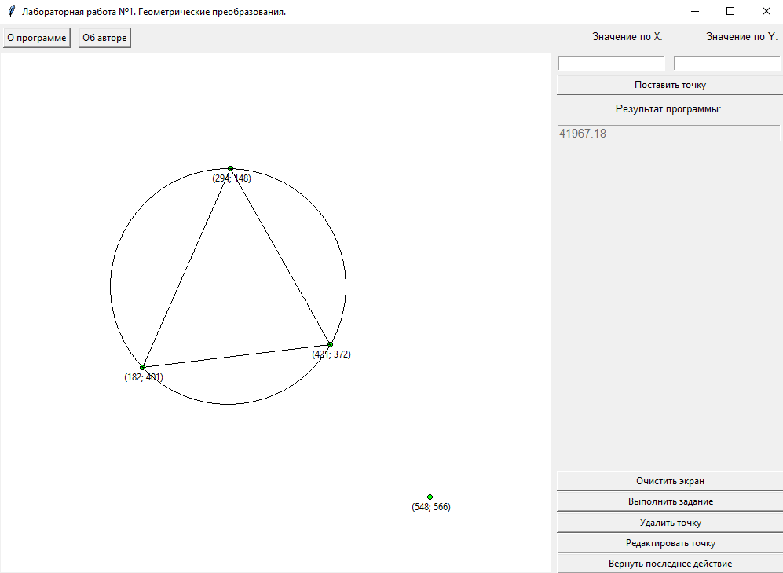

# Лабораторная работа №1
Нарисовать исходный рисунок, затем его переместить, промасштабировать, повернуть.
Из заданного на плоскости множества точек выбрать три различные точки так, чтобы
разность между площадью круга, ограниченного окружностью, проходящей через эти
три точки, и площадью треугольника с вершинами в этих точках была минимальной.

